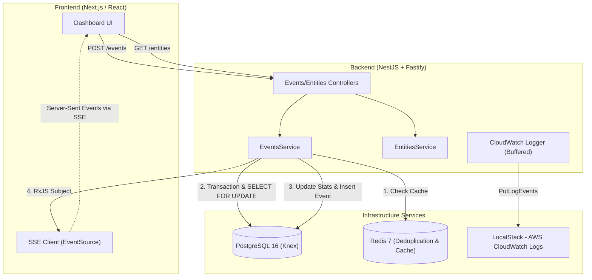
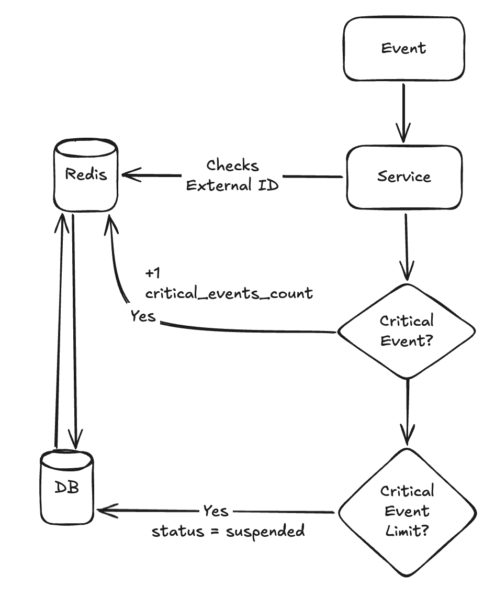
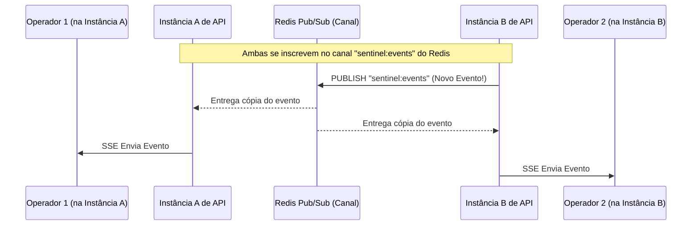

# Holocron Sentinel — Sistema de Monitoramento da Aliança Rebelde

O **Holocron Sentinel** é um sistema estratégico que registra eventos e emite alertas em tempo real sobre atividades críticas e possíveis ameaças, suspendendo automaticamente entidades que atinjam o limite crítico de segurança. O projeto foi desenvolvido com base nos requisitos detalhados no [Desafio Técnico](problem.md).

---

## 🚀 Como Executar o Projeto Localmente

### Pré-requisitos

- [Docker](https://www.docker.com/) e Docker Compose instalados.
- [Node.js](https://nodejs.org/) (versão 18 ou superior).

### 1. Clonar e Configurar Variáveis de Ambiente

Crie os arquivos `.env` copiando os respectivos templates para o backend e o frontend:

```bash
cp backend/.env.example backend/.env
```

```bash
cp frontend/.env.example frontend/.env
```

### 2. Inicializar a Infraestrutura (Docker)

Suba os containers do PostgreSQL, Redis e LocalStack em segundo plano:

```bash
docker compose up -d
```

### 3. Instalar Dependências e Rodar Migrações

Instale todas as dependências do monorepo e execute as migrações do banco de dados do backend:

```bash
npm run install:all
```

```bash
npm run migration:run
```

### 4. Iniciar Servidores de Desenvolvimento

Inicie tanto o backend (porta `3001`) quanto o frontend (porta `3000`) simultaneamente em modo de desenvolvimento:

```bash
npm run dev
```

- **Frontend**: Acesse [http://localhost:3000](http://localhost:3000)
- **Backend (SSE Stream)**: Acesse [http://localhost:3002/events/stream](http://localhost:3002/events/stream)

---

## 🏗️ Arquitetura do Sistema

O sistema é construído sobre uma arquitetura que dividida em três camadas principais: o cliente web (Next.js), a API (NestJS com Fastify) e os serviços de infraestrutura (PostgreSQL, Redis e LocalStack).





### Stack Tecnológica

- **Frontend**: Next.js 15+, TypeScript, TailwindCSS/Vanilla CSS, EventSource para Server-Sent Events (SSE).
- **Backend**: NestJS (com adaptador **Fastify** para maior vazão e menor latência), TypeScript, Knex.js (Query Builder estruturado).
- **Banco de Dados**: PostgreSQL 16.
- **Cache e Deduplicação**: Redis 7.
- **Observabilidade & Logs**: AWS SDK v3 com LocalStack (CloudWatch Logs) para centralização e auditoria de logs.

---

## ⚡ Estratégia de Concorrência e Idempotência

O endpoint de registro de eventos (`POST /events`) foi projetado para suportar cargas elevadas e requisições simultâneas concorrentes para o mesmo `external_id` ou para a mesma `entity_id`.

### 1. Garantia de Idempotência (Evitar duplicados)

Para garantir que um evento com o mesmo `external_id` nunca seja processado duas vezes, implementamos uma estratégia de proteção em dois níveis:

1.  **Cache Distribuído (Redis)**: Ao receber um evento, a API verifica a existência do `external_id` no cache do Redis (TTL de 24h). Se já existir, a API retorna imediatamente o registro leve armazenado sem onerar o banco de dados relacional.
2.  **Chave Única no Banco (PostgreSQL)**: A coluna `external_id` possui uma restrição de unicidade (`UNIQUE`). Se duas requisições idênticas bypassarem a validação de cache simultaneamente (devido a latência de rede), a transação do banco interceptará a duplicata lançando um erro. O backend captura essa exceção e trata elegantemente retornando o evento original marcado com a flag `{ is_duplicate: true }`.

### 2. Controle de Concorrência (Race Conditions)

Múltiplos eventos podem ser disparados simultaneamente para a mesma entidade. Para atualizar corretamente o contador `critical_events_count` e decidir se a entidade deve ser suspensa:

- Abrimos uma transação no banco de dados.
- Executamos um bloqueio de linha utilizando `.forUpdate()` na entidade (`SELECT * FROM entities WHERE id = ? FOR UPDATE`).
- Esse bloqueio garante a serialização dos updates para a mesma entidade, assegurando que o contador seja incrementado de forma consistente e a entidade seja suspensa exatamente ao atingir o limite crítico determinado em `CRITICAL_EVENTS_LIMIT` (padrão: `3`), rejeitando eventos subsequentes de imediato.

---

## 📡 Streaming em Tempo Real (SSE)

Para atualizar o dashboard dos operadores sem a necessidade de polling ineficiente, utilizamos **Server-Sent Events (SSE)** através da rota `GET /events/stream`.

- **Por que SSE em vez de WebSockets?** O fluxo de informações é prioritariamente unidirecional (do servidor para o cliente). SSE funciona sobre HTTP padrão, aproveita a compressão nativa, suporta reconexão automática out-of-the-box e consome consideravelmente menos recursos do servidor em comparação com conexões bi-direcionais persistentes de WebSocket.
- **Implementação Backend**: O `EventsService` utiliza um RxJS `Subject`. Sempre que um evento é persistido com sucesso na transação, ele é publicado no Subject. O controller expõe a rota anotada com `@Sse('stream')`, convertendo o fluxo em um canal contínuo de eventos para os clientes.
- **Resiliência no Frontend**: O hook `useDashboard` gerencia a conexão com `EventSource`. Caso ocorra uma desconexão do servidor, o cliente detecta a falha e tenta reconectar automaticamente a cada 5 segundos.
- **Atualização Incremental da UI**: Quando um evento chega pelo stream, o frontend atualiza os estados locais (lista de eventos, entidades atualizadas e ranking crítico) instantaneamente na tela do operador de forma otimista.

---

## 📈 Otimização de Performance

Em um cenário com milhões de eventos e milhares de entidades, os endpoints de leitura precisam ser altamente eficientes:

1.  **Agregações Inteligentes no Postgres**: A listagem de entidades agrega o total de eventos e a data do último evento executando `COUNT` e `MAX` nativamente no banco agrupado por `e.id`, eliminando a necessidade de mapeamentos custosos de memória no NodeJS.
2.  **Índices Estratégicos**: A tabela de eventos possui índices aplicados na chave estrangeira `entity_id` e uma chave única em `external_id` (que gera um índice automático), acelerando as junções e as validações de idempotência.
3.  **Caching**: Entidades validadas com frequência durante o recebimento de eventos são cacheadas no Redis. A cada evento processado com sucesso, o cache correspondente da entidade é invalidado para garantir a consistência das próximas requisições.

---

## 🏢 O que faríamos diferente em produção?

Em um ambiente de produção real, sob volumes de dados massivos, aplicaríamos os seguintes aprimoramentos arquiteturais:

1.  **Processamento Assíncrono via Filas (Message Queue)**:
    Decoplaríamos a rota de ingestão de eventos (`POST /events`) do processamento de negócio. A API apenas persistiria o evento bruto em uma fila (SQS, BullMQ, RabbitMQ, Kafka) e responderia imediatamente `202 Accepted`. Consumidores em background processariam as filas de forma escalável e resiliente.
2.  **Locks Distribuídos no Redis (Redlock)**:
    Substituiríamos o bloqueio pessimista do PostgreSQL (`FOR UPDATE`) por **Distributed Locks** via Redis (utilizando algoritmos como Redlock). Isso evitaria a retenção de conexões abertas no pool do banco de dados relacional em momentos de alta carga.
3.  **Particionamento de Tabelas**:
    A tabela `events` cresceria exponencialmente. Em produção, aplicaríamos o **Table Partitioning** (particionamento por tempo, ex: semanal ou mensal) no PostgreSQL, mantendo os índices de cada partição pequenos e permitindo o arquivamento/descarte simples de dados antigos.
4.  **Pub/Sub do Redis para SSE Horizontal**:
    Se escalarmos horizontalmente o backend em múltiplas instâncias (containers), um cliente conectado na Instância A não receberia eventos disparados na Instância B. Integraríamos a transmissão do SSE com o **Redis Pub/Sub**, permitindo que todas as réplicas ouvissem os novos eventos e os distribuíssem aos seus clientes locais.



- Quando as instâncias da API iniciam, todas elas se conectam ao Redis e se "inscrevem" (Subscribe) em um canal compartilhado, por exemplo, sentinel:events.
- Quando a Instância B recebe um novo evento, em vez de guardar apenas na sua memória local, ela publica (Publish) esse evento no canal do Redis.
- O Redis, instantaneamente, distribui esse evento para todas as instâncias da API inscritas (tanto a A quanto a B).
- Ao receber o evento vindo do Redis, a Instância A repassa para o Operador 1, e a Instância B repassa para o Operador 2.

---

## 🧪 Suíte de Testes e Simulações

### Executando Testes Unitários

Para validar as regras de negócio de criação de entidades, registro de eventos, validação de limites e idempotência:

```bash
npm run test:backend
```

### Executando Testes de Carga (JMeter)

A raiz do repositório contém um plano de teste de performance (`test.jmx`) configurado para o Apache JMeter.
Ele realiza requisições simultâneas em lote simulando envio contínuo de eventos para avaliar a robustez das travas de concorrência e idempotência do NestJS/Postgres/Redis.
